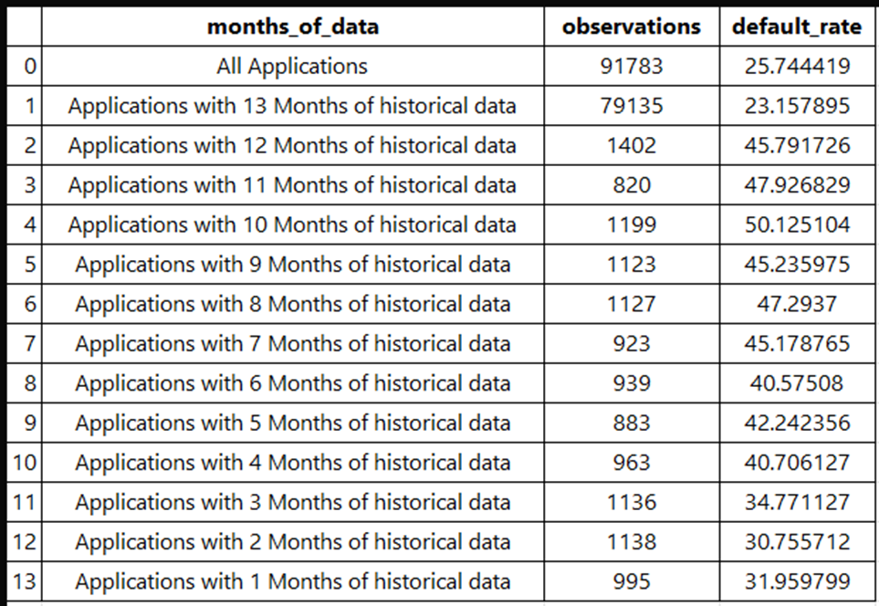

# Credit Risk Analysis using Machine Learning

**Team Members**: Dheeraj Rahul Reddy Piduru · Sachin Jain · Kota Manasseh Jesrun  
**Tech Stack**: XGBoost · Neural Networks · SHAP · Python · Scikit-learn · Keras · Pandas  
**Dataset**: [Kaggle - Amex Default Prediction](https://www.kaggle.com/competitions/amex-default-prediction)

---

## Project Objective
To build a machine learning model that accurately predicts credit default risk and supports strategic credit approval by balancing profit maximization and risk control.

---

## Data Overview

- Source: Kaggle American Express Default Prediction dataset  
- Time Period: April 2017 – April 2018  
- Why this period?
  - Captures full financial year seasonality
  - Ensures pre-pandemic economic stability

---

## Data Processing

- Data Merging: Joined transactional data with default labels
- Data Filtering: Selected customers with complete 13-month history
- One-Hot Encoding: Added 55 new features after encoding categorical variables

---

## Feature Engineering

- Numerical Aggregation: Computed 30, 90, and 180-day means
- Categorical Aggregation: Used mode across time for each category
- Feature Expansion: Increased feature count from 189 to 389
- Missing Value Imputation: Replaced with zero
- Outlier Treatment: Capped values using 1st and 99th percentiles
- Normalization: Applied StandardScaler from sklearn

---

## Modeling Approaches

### 1. XGBoost
- Hyperparameter Tuning: Grid search across:
  - n_estimators, learning_rate, subsample, colsample_bytree, scale_pos_weight
- Best Model:
  - AUC (Train/Test1/Test2): 0.9417 / 0.9394 / 0.9406  
  - Average AUC: 0.9406  
  - Overfit metric: 0.0601

### 2. Neural Network
- Architecture: 2 hidden layers, 6 nodes each
- Activation: Tanh
- Batch Size: 100
- Best Model:
  - AUC (Train/Test1/Test2): 0.9324 / 0.9328 / 0.9338  
  - Average AUC: 0.9331  
  - Overfit metric: 44.80

---

## Model Selection

Final Model: **XGBoost**  
Chosen for its higher AUC, lower variance, and superior interpretability.

---

## Model Interpretability

### SHAP Analysis
- Used SHAP values to interpret feature contribution.
- Key findings:
  - P_2 (Payment variable): Higher values reduce default risk (negative correlation)
  - S_3 (Spend variable): Higher values increase default risk (positive correlation)

---

## Strategy Design

Simulated different approval thresholds from 0.1 to 1.0. Compared:
- Total Approved Customers
- Default Rate
- Revenue Generated

| Strategy             | Revenue (Test Avg) | Default Rate |
|----------------------|--------------------|---------------|
| Conservative (0.3)   | 819.65              | 4.26%         |
| Aggressive (0.54)    | 890.63              | 8.99%         |

---

## Key Takeaways

- Data preprocessing and feature engineering significantly improved model performance
- XGBoost outperformed neural networks in both predictive accuracy and interpretability
- Strategy trade-offs (conservative vs. aggressive) allow for custom risk-return alignment

---

## Folder Structure

